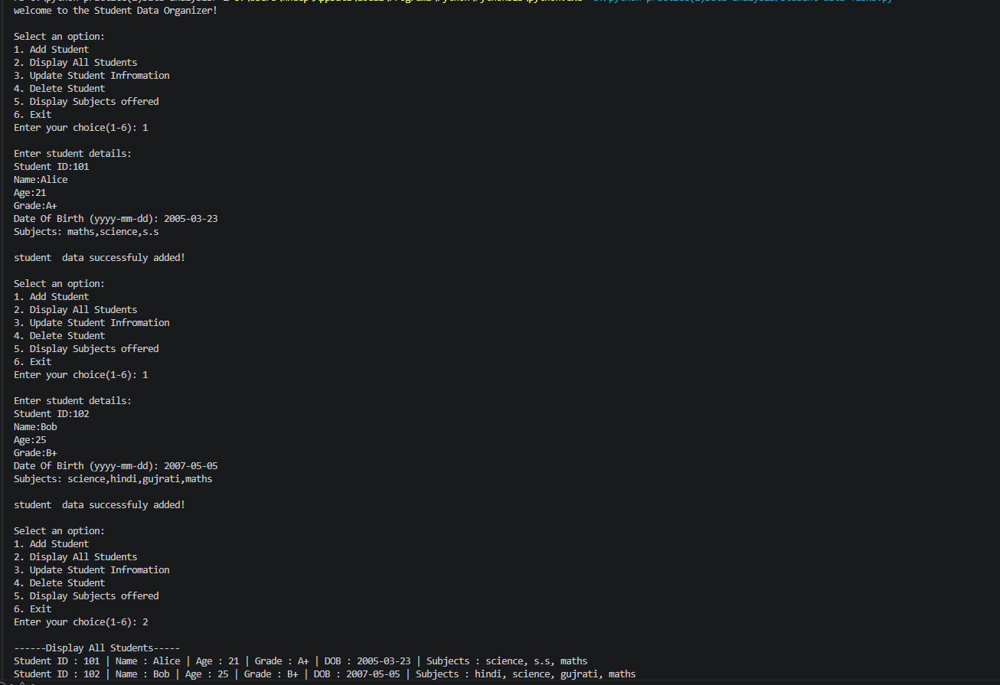
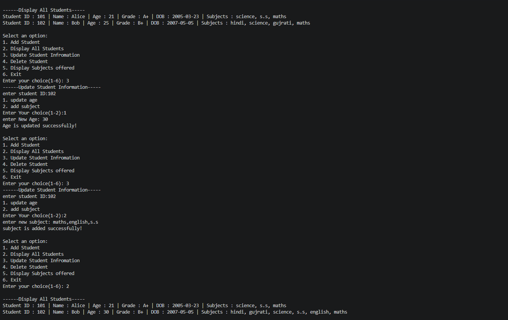
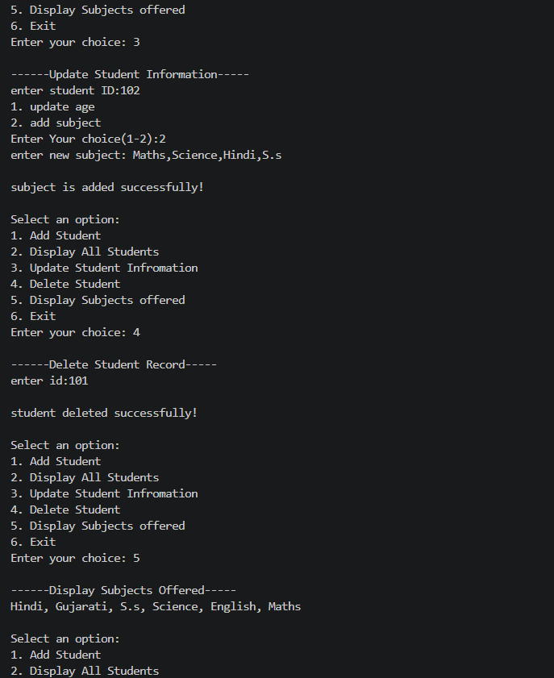
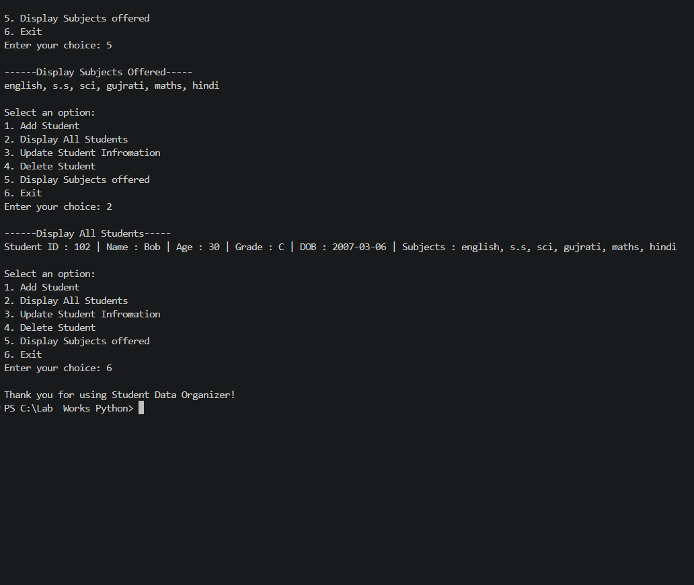

# 🎓 Student Data Organizer

A Python Student Data Organizer using Dictionary, List, tuple, and Set

---

## 📌 About the Project

The Student Data Organizer is a menu-driven Python application designed to manage student records in an easy and organized way. It allows users to perform different student management operations through a simple text-based interface.

This project demonstrates the practical use of Python collections such as Dictionary, List, and Set, along with loops, conditional statements, and functions.

---

## 🎯 Objectives

* Store student records efficiently.
* Practice Python collection data types.
* Learn menu-driven programming.
* Perform CRUD (Create, Read, Update, Delete) operations.
* Display unique subjects using Python Set.

---

## 🌟 Key Features

### ➕ Add Student

* Add a new student record.
* Store Student ID, Name, Age, Grade, Date of Birth, and Subjects.

### 📋 Display All Students

* View all stored student records in a formatted manner.

### ✏️ Update Student Information

* Modify an existing student's details using the Student ID.

### 🗑 Delete Student

* Remove a student record from the database.

### 📚 Display Subjects Offered

* Display all unique subjects.
* Automatically removes duplicate subject names.

### 🚪 Exit Program

* Close the application safely with a thank-you message.

---

## 🧰 Technologies Used

- Python 3.x
- Visual Studio Code (VS Code)
- GitHub

---

## 📁 Folder Structure

```text
Student-Data-Organizer/
│
├── student_data_organizer.py
├── README.md
├── Output1.png
├── Output2.png
├── Output3.png
```

---

## ▶️ How to Run

1. Install Python 3.x on your computer.
2. Clone or download this repository.
3. Open the project in Visual Studio Code.
4. Run the following command:

```bash
python Student_Data_Organizer-Task3.py
```

---

## 📋 Application Menu

```text
==============================
 STUDENT DATA ORGANIZER
==============================
1. Add Student
2. Display All Students
3. Update Student Information
4. Delete Student
5. Display Subjects Offered
6. Exit
```

---

## 📷 Program Output

### Main Menu





## 🎥 Video Demonstration

 video link:[https://drive.google.com/file/d/1szKXLYfcEaLiAUzmsiQfQR0pLsSi7NIa/view?usp=sharing] 

## 💭 Assumptions

* Student ID should be unique.
* Age must be greater than zero.
* Date of Birth should follow the **YYYY-MM-DD** format.
* Subjects should be entered as comma-separated values.
* Duplicate subjects are removed using Python Set.
* Invalid menu options display an appropriate error message.
---

## 📖 Python Concepts Covered

* Functions
* Dictionary
* List
* Set
* While Loop
* If-Else
* Input Validation
* CRUD Operations
* Menu-Driven Programming
---

 ## ⭐ Thank You
 
Thank you for visiting this repository.

---
